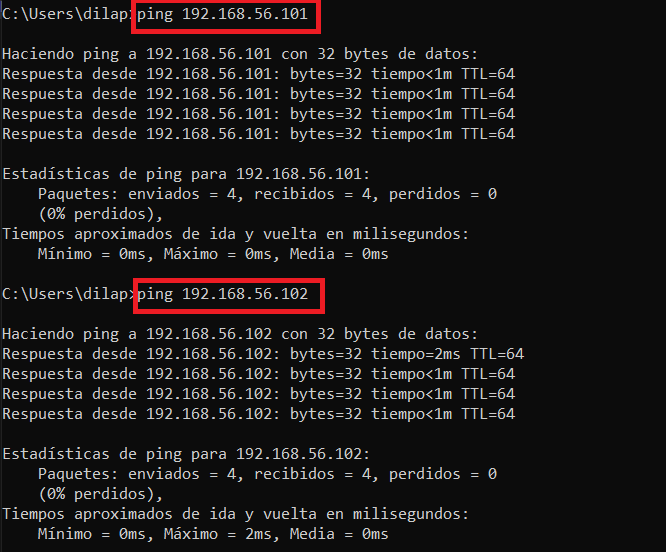
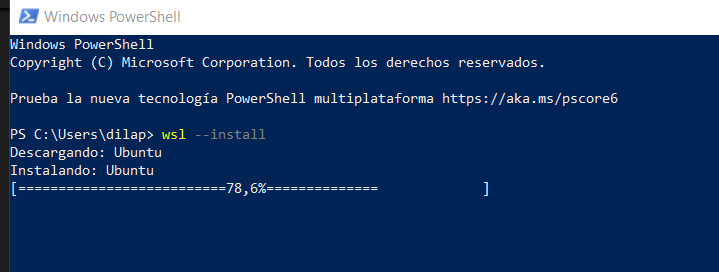
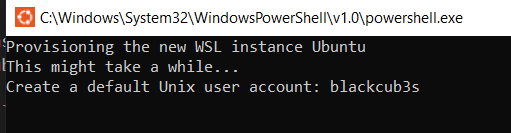
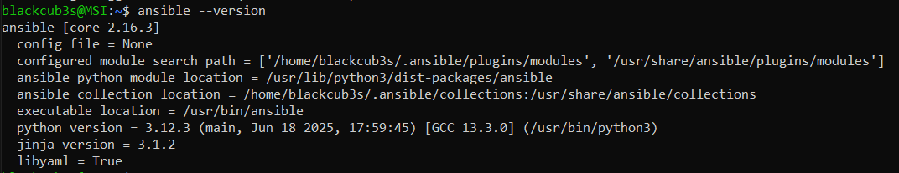
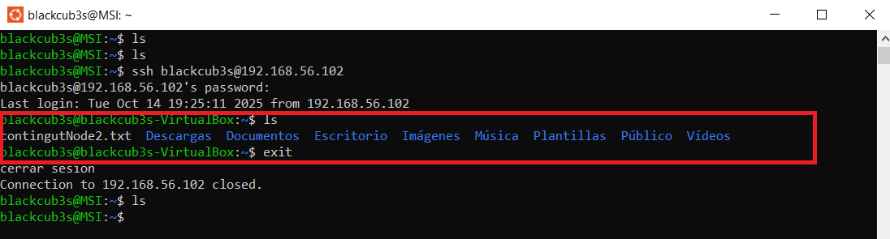
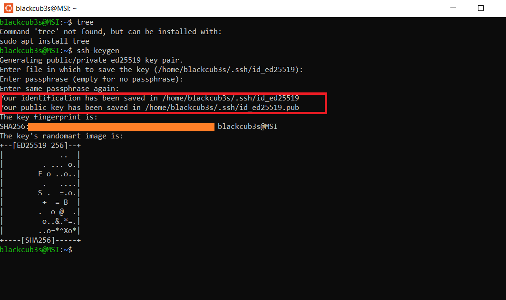
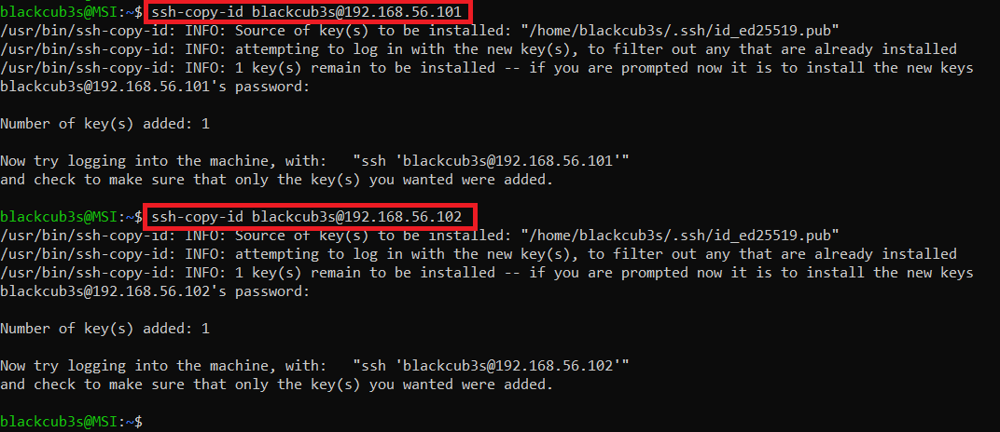
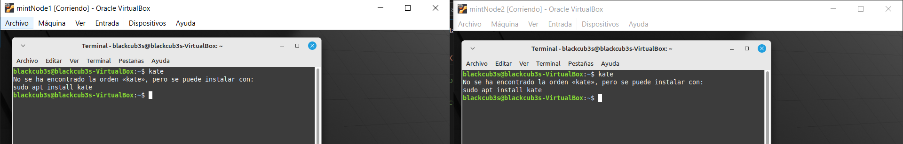
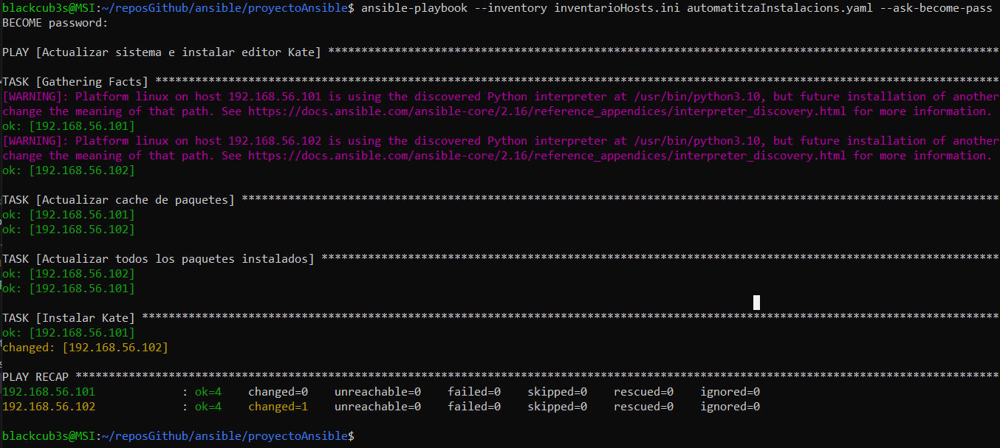
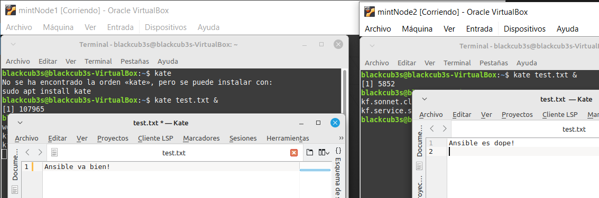

En este README mostraré los aprendizajes hechos con Ansible. **Y los archivos están en la raíz del proyecto.**

# 1. Introducción

¿Qué es ansible? Ansible, de acuerdo con el manual de O'reily que podéis consultar en la nota al pie [^1],  es "una de las plataformas más recientes de automatización y gestión de configuración de TI que existen en el mundo del código abierto", y más concretamente "Ansible es una plataforma de automatización súper simple, sin agentes (*agentless*) y extensible". 

- "*agentless*" $\rightarrow$ En el libro de O'reily nos vienen a decir que a diferencia de otras herramientas similares (Puppet, Chef) Ansible NO REQUIERE que cada dispositivo que estemos atuomatizando (servidor o máquina) requiera software instalado. En otras palabras, que si queremos instalar kubernetes en 4 servidores solo necesito instalar ansible en un solo equipo el equipo que uso para configurar esos otros 4 servidores.

- *extensible* $\rightarrow$ Permite instalar plugins y expandir sus capacidades, que no viene limitado de fábrica. Esos plugins además son creados por la comunidad open source, el propio usuario puede extender sus funcionalidades.


# 2. Preparación

La idea es que desde el host Windows de mi PC hacer instalaciones automáticas a *n* servidores. El host de Windows será el "**control node**" o "máquina de control" en la terminología Ansible. 

Luego, para ello necesitamos los servidores; pero dado que no los tenemos haremos que los "servidores" que queremos automatizar (que en la terminología de ansible se llaman "**Managed nodes**" o "máquinas remotas") sean simplemente sendas máquinas virtuales con linux mint instalado dentro del propio host.

Para crear estas dos máquinas virtuales usaremos virtualbox que ya tienen linux mint instalado en su interior. Es importante que las dos máquinas virtuales tengan dos adaptadores de red:

- El **primero** será `NAT` $\rightarrow$ para el acceso a internet de cada "servidor"
- El **segundo** será  `Adaptador solo anfitrion` $\rightarrow$ para que accesibles desde windows. 

La configuración en virtual box quedará así:


## 2.1. Obtención de las IPs de los "servidores"

Necesitamos primeramente las IPs de las dos máquinas virtuales ("servidores") que harán de "managed nodes", es decir, donde podremos usar ansible desde windows para que nos permita automatizar infraestructura: podremos crear configuraciones, instalar software, configurar redes, etc.

Para ello vamos a cada una de ellas, la arrancamos, y en sus respectivas terminales escribimos el comando:

`ip addr show`

Así obtenemos la IP de cada "servidor" en cada una de sus terminales:


Por lo tanto las IPs son:

*mintNode1* $ \rightarrow $ 192.168.56.101
*mintNode2* $ \rightarrow $ 192.168.56.102

Ahora comprobamos que podemos establecer comunicación con ambos "servidores" _desde_ windows con el comando *ping* y vemos que funciona todo sin problemas, dado que se envían y reciben de vuelta los paquetes:




>NOTA: Las IPs de los "servidores" no están configuradas como fijas. Podrían cambiar al reiniciar, si eso pasa hay que hacer configuración adicional para hacer que las IPs sean fijas. Pero por ahora no ha sido necesario


## 2.2. Instalación de wsl en windows

Ansible requiere entorno linux. Asi que en windows instalaremos el substistema linux para windows con el comando siguiente en powershell:

```wsl --install```

Tal que así:







Después de instalar descargamos y actualizamos paquetes con el gestor apt:

```
sudo apt update
sudo apt upgrade
```

Y ahora ya podemos INSTALAR ansible con el comando:

```
sudo apt install ansible
```
Y para comprobar miraremos si está instalado usando el comando ansible con la flag --version. Si devuelve algo como lo siguiente lo hemos hecho bien:



## 2.3. Configurar el acceso a los "servidores" con SSH.
    
Para que el nodo de control (mi windows con el WSL) se conecte a las máquinas virtuales sin contraseñas usaremos SSH. Así verdaderamente conseguiremos que Ansible funcione de forma automatica.

Para conectarnos a un servidor remoto la sintaxis desde el WSL será esta:

```
ssh usuarioServidorRemoto@direccionIPdelServidor
```

Por lo tanto dado que el usuarios que utilizo en ambas máquinas virtuales (tanto *mintNode1* como *mintNode2*) es blackcub3s desde el wsl de windows usaré estos comandos:

* ssh blackcub3s@192.168.56.101 $\rightarrow$ para conectar con *mintNode1*

* ssh blackcub3s@192.168.56.102 $\rightarrow$ para conectar con *mintNode2*

Ojo, porque aquí si debemos ir a cada máquina e instalar en cada una SSH porque linux no lo trae por defecto. Sin SSH en cada *managed node* no es posible usar Ansible.

Vamos a cada máquina virtual y hacemos en su respectiva terminal:

```
sudo apt install ssh
```
Luego desde el wsl ya podemos conectarnos en remoto a ella y acceder a su terminal desde el WSL de windows con los comandos anteriores. Por ejemplo, la conexión en remoto a mintNode2 y su terminación (comando exit) los hacemos así:



# 2.4. Configurar las contraseñas de SSH en el nodo de control

Para que Ansible funcione sin contraseñas, necesitamos que las máquinas virtuales (los "servidores") confíen en el nodo de control (la WSL de Windows). Eso se logra copiando la clave pública de SSH a cada VM y creando una clave privada que guardamos en el wsl que luego la VM o "servidor" reconocerá si hace match o no con ña clave pública: si hace match tendremos acceso (es decir, ya no tendremos que introducir la contraseña de cada "servidor" sino que solo habrá una contraseña: la clave privada del wsl).

La generación del archivo de clave privada y de clave pública (.pub) se hace con:

```ssh-keygen```

Tal que así:




Ahora debemos copiar el archivo de la clave pública generada a partir de la contraseña (.pub situado en el wsl dentro de .ssh/id_ed25519.pub) en cada uno de los "servidores" usando el comando **ssh-copy-id** así:

```
ssh-copy-id blackcub3s@192.168.56.101
ssh-copy-id blackcub3s@192.168.56.102
```

Estos comando copian este contenido hacia el interior de cada servidor en la ruta ```/home/blackcub3s/.ssh/authorized_keys```. `Authorized_keys` es un archivo que se crea con este comando, si no existe, y en su interior se añade mediante el mismo la clave pública que emana de la clave privada que tenemos en el wsl (puede que añada varias claves públicas si se repite el comando, no es idempotente cuidado: repetiríamos líneas).  



# 2.5. Tomar la contraseña de forma automática CADA VEZ que encendemos el wsl:

Para acceder con una sola contraseña a los dos servidores y no tener que hacer nada, en teoría podemos usar **ssh-agent**: para CADA USO de WSL tenemos que correr este comando. 
```
eval "$(ssh-agent -s)"
ssh-add ~/.ssh/id_ed25519
```
Si lo hacemos tecnicamente no habrá que poner ninguna contraseña al conectarse al WSL. Así es con ssh manualmente.

Sin embargo, para que ansible tome la clave privada sin tener que hacer este paso el truco es usar el parámetro que comentamos antes `ansible_ssh_private_key_file` y definir ahí la ruta donde se encuentra la clave privada dentro del WSL. Este parámetro lo escribiremos dentro de `inventarioHosts.ini` escribiendo la [ésta línea](https://github.com/blackcub3s/ansible/blob/8b982de246e5aa61fa4a384f89ed0b9e44024afd/proyectoAnsible/inventarioHosts.ini#L10):

```
ansible_ssh_private_key_file=/home/blackcub3s/.ssh/id_ed25519
```
Para entender a lo que nos referimos con automatizar el uso de la clave privada ponemos esta imagen que demuestra la utilidad de usar ssh-agent cada vez que iniciamos el wsl, porque nos permite no poner contraseñas constantemente al usar ssh. En teoría debería transferir a ansible, pero no es el caso (de ahi que usemos ansible_ssh_private_key_file).


> **NOTA**: Si no queremos usar `ssh-agent` cada vez que iniciamos podemos guardar la clave privada y pasarla por
`ansible_ssh_private_key_file` como vemos en la documentación [^2].

# 3. Instalación de Ansible

Ahora que ya tenemos SSH bien configurado sin que pida contraseñas manualmente y podemos instalar ansible (después de actualizar la lista de paquetes -update- y actualizar aquellos para los que se puede obtener una versión más reciente -upgrade-):


```
sudo apt update
sudo apt upgrade -y
sudo apt install ansible -y
```

Hecho esto verificamos que ansible está instalado con:

```
ansible --version
```

# 4. Uso de Ansible

Ahora vamos a usar Ansible para un ejemplo muy sencillo: automatizar la instalación de un editor de código en ambas maquinas virtuales. El editor no está instalado en ellas: es el editor kate.

Como vemos en la documentación oficial [^2], para hacerlo, hay que crear un **archivo de inventario** donde definiremos cuáles serán los "managed nodes" que automatizaremos, por un lado; y las variables asociadas a estos "managed nodes", por el otro.

Esto se puede hacer con un archivo .ini, muy visual y más idóneo para configuraciones sencillas; o un .yaml, que es más complejo pero más moderno y flexible para cuando los proyectos crecen.

Este archivo `.ini` o `.yaml` estará en el equipo donde esté instalado ansible, que será el "control node"; en nuestro caso el wsl para Windows.

# 4.1. Estructura básica del proyecto (ejemplo sencillo)

La estructura de un proyecto con ansible es esta:

```
ansible_project/
 ├── archivoHosts   # archivo de inventario (.ini o .yaml)
 ├── unPlayBook.yml # tu playbook
 └── roles/         # opcional: organizar tareas complejas
```
En este caso particular, el que correremos con ansible en WSL, nos pondremos un objetivo muy simple: **automatizar una instalación de un editor de código denominado "Kate" mediante el gestor de paquetes `apt` en los dos "servidores" o "managed nodes".

Este ejemplo podría darse si somos administradores de sistemas de todos los equipos linux de una universidad, por ejemplo. Si un profesor nos pide que en todos los ordenadores tiene que haber el editor kate, porque este es el editor con el que han programado todo el curso ir ordenador por ordenador sería un suplicio. Sin embargo, con Ansible, siempre que los ordenadores estén en la misma red, sería sencillo de hacer.

Para ello hemos creado:


- El **inventario**: aquí definimos las IPs de los "managed nodes" y los GRUPOS a los que pertenecen estos "managed nodes" (tambien denominados "hosts"). En este caso particular tenemos [inventarioHosts.ini](/proyectoAnsible/inventarioHosts.ini) donde añadimos las IPs de los hosts en nuestra red en un grupo denominado `nodesLinuxMint`:

https://github.com/blackcub3s/ansible/blob/8b982de246e5aa61fa4a384f89ed0b9e44024afd/proyectoAnsible/inventarioHosts.ini#L1-L10


- El **playbook**: nos define las tareas que vamos a hacer con los equipos o servidores que hemos definido en el archivo del inventario o de los hosts (véase nuestro [automatitzaInstalacions.yaml](/proyectoAnsible/automatitzaInstalacions.yaml)). 

Este playbook en concreto hará tres cosas, por orden:

```
sudo apt update
sudo apt upgrade
sudo apt install kate
```

Y su código es como sigue:

https://github.com/blackcub3s/ansible/blob/8b982de246e5aa61fa4a384f89ed0b9e44024afd/proyectoAnsible/automatitzaInstalacions.yaml#L1-L17

NOTA: Mención expresa merece el uso de "state". Puede tomar cuatro valores distintos que harán que el comportamiento de la instalación con apt sea distinto. A saber:

    - present:      Si ya está instalado no hace nada; si no lo está, lo instala (si algo funciona no lo toques: que es el que hemos usado aquí)
    - absent:	Desinstala el paquete.
    - latest:	Instala la versión más reciente disponible
    - reinstalled:  Reinstala el paquete aunque ya esté instalado.


# 4.2. Ejecutar el playbook

Antes de su ejecución vemos que en las máquinas virtuales kate no está instalado:



Ahora ejecutamos el playbook. Para hacerlo tenemos el comando `ansible-playbook` y le pasaremos la flag `--inventory` para que no mire el archivo de los hosts de la carpeta por defecto (`/etc/), luego el nombre del playbook y MUY IMPORTANTE necesitamos definir la flag --ask-become-pass para que nos pida el password de superusuario de los equipors (al definir ```become: yes``` DENTRO del playbook le estamos pidiendo de usar sudo, y sudo tiene su propia contraseña en cada equipo).

```
cd proyectoAnsible
ansible-playbook --inventory inventarioHosts.ini automatitzaInstalacions.yaml --ask-become-pass
```

Al hacer esto por la terminal se indica la realización de cada una de las tareas, encabezada por los nombres (name) que les dimos en el playbook automatitzaInstalacion (las que salen en verder es porque ya estaban instaladas de pruebas previas y en amarillo es la que ha supuesto el cambio en la última ejecucion del último comando):



Ahora si vamos a las máquinas virtuales veremos que ya tenemos los editores kate instalados de forma automática:




[^1]: Edelman, J. (2016). *Network Automation
with Ansible*. Red Hat, Inc.

[^2]: https://docs.ansible.com/ansible/latest/inventory_guide/intro_inventory.html
